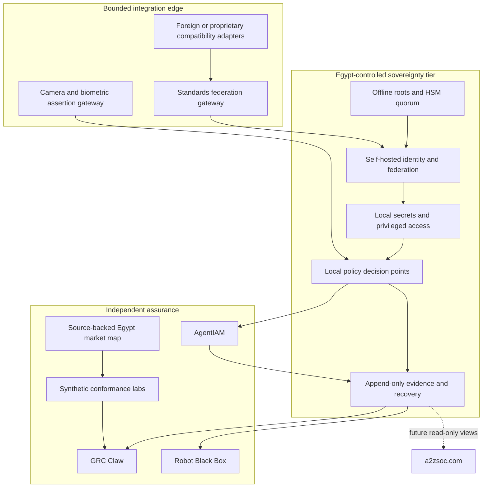

# Egypt Digital Trust Map

[](https://github.com/AAH20/egypt-digital-trust-map/actions/workflows/verify.yml)
[](LICENSE)

An open, bilingual-ready registry, sovereignty profile, and interoperability lab for Egypt's IAM, PAM, PKI, cybersecurity, biometrics, video-surveillance governance, AI-agent identity, and critical-infrastructure ecosystem.

The project separates three things that are often confused:

1. **A player exists** — supported by a dated public source.
2. **A player claims a capability** — recorded as a claim, not an endorsement.
3. **An integration passed a test** — supported by a reproducible evidence bundle.

The current release is a source-backed registry and executable validation tool. It does not claim certification, regulatory approval, market share, or product endorsement. Coverage is comprehensive for the named, dated official snapshots and expands through source-backed pull requests and scheduled verification.

## Sovereignty rule

Egyptian digital sovereignty means that Egyptian operators retain effective control of root keys, authorization policy, privileged recovery, identity and biometric data flows, audit evidence, software-update admission, and supplier exit. A product's country of origin is a supply-chain input, but it is not a substitute for testing those controls.

The sovereignty tier therefore requires:

- Egypt-controlled HSM roots and recovery shares.
- Local authentication, authorization, revocation, and PAM decisions during external isolation.
- No standing vendor super-admin or mandatory foreign management plane.
- Quorum approval for root, recovery, trust-domain, and emergency changes.
- Short-lived human, workload, agent, device, and robot credentials.
- Independently retained append-only evidence.
- Tested export, restore, migration, rollback, and supplier-exit procedures.

Foreign proprietary platforms may be supported through bounded compatibility adapters. They cannot be the sole or irreplaceable root of trust for a deployment claiming the sovereign profile.

## Why this repository exists

Egypt has authoritative but distributed information: EG-CERT publishes accredited cybersecurity providers; ITIDA publishes licensed digital-signature providers; vendors and integrators publish their own services; and identity, physical security, and AI governance are normally evaluated in separate procurement processes. This repository provides one open data model for examining those relationships without collecting operational credentials, biometric templates, or surveillance footage.

## Architecture



## Repository structure

```text
registry/                 Source-backed market records
integrations/             Protocol and product-family profiles
sovereignty/              Weighted profile, hard gates and fixtures
hierarchy/                Public-safe, compartmented trust model
benchmarks/               Executable gates and scored measures
controls/                 Governance control catalog
schemas/                  JSON Schema contracts
src/egypt_trust_map/      Dependency-free validator and CLI
tests/                    Registry, hierarchy and benchmark tests
docs/                     Governance, contribution and roadmap detail
```

## Market coverage

The repository now contains four complementary datasets:

- A nine-entry core trust registry covering NTRA/EG-CERT, ITIDA, the Egyptian Root CA context, GOV-CA, ITIDA-listed trust-service providers, CyShield, and ZeroTech.
- A 42-entry snapshot of every numbered organization visible in the official EG-CERT accredited cybersecurity-provider register on the verification date.
- A 48-record sector ecosystem covering the named public authorities, all four NTRA-listed mobile-network operators, all 36 banks named on the CBE Instant Payment Network page, and live-registry references for regulated financial and payment institutions.
- A 35-target technology catalog spanning open identity and policy components, enterprise IAM/PAM compatibility, video-management, camera, biometric, agent, workload, evidence and physical-AI interfaces.

Registry entries carry verification dates and public sources. Inclusion means only that public evidence exists. Accreditation applies only to the service and customer scopes in the live official register and must be rechecked before procurement.

The architecture model adds seven tiers, 27 abstract nodes, four information compartments and three explicit information-flow rules. The benchmark catalog adds 28 non-compensating gates and four weighted operational measures. These models use organization names and abstract roles only; they do not publish personnel, credentials, key material, biometric records, endpoints, deployments or operational topology.

## Main integration profiles

- Sovereign identity: Keycloak, FreeIPA, Samba AD and OpenLDAP behind OIDC, SAML, LDAP and SCIM contracts
- Strong authentication: FIDO2/WebAuthn, locally controlled PKI and Egyptian trust-service integration
- Secrets and PAM core: OpenBao, short-lived SSH/X.509/database credentials, HSM-backed recovery and dual control
- Workload identity: SPIFFE/SPIRE with local trust domains and attestation
- Authorization: OpenID AuthZEN, AgentIAM and OPA/Rego contracts
- Video and biometrics: isolated ONVIF gateways and signed assertions, with synthetic fixtures only
- Evidence: OpenTelemetry, OSCAL-compatible mappings, GRC Claw and Robot Black Box receipts
- Foreign proprietary products: compatibility and migration adapters subject to sovereignty hard gates

Product names identify integration targets and do not imply affiliation.

## Run locally

```bash
python -m pip install -e .
egypt-trust-map verify
egypt-trust-map summary
egypt-trust-map assess-sovereignty
egypt-trust-map verify-hierarchy
egypt-trust-map benchmark
python -m unittest discover -s tests -v
```

Evaluate the included negative fixture:

```bash
egypt-trust-map assess-sovereignty \
  --assessment sovereignty/foreign-saas-negative-fixture.json
```

It intentionally exits non-zero because mandatory foreign control, missing local evidence, weak exit, and standing vendor access cannot be compensated by feature scores.

## Sovereignty score

The executable profile contains seven hard gates and eight weighted dimensions totaling 100 points. A deployment must pass every hard gate and score at least 80. A score of 100 with one failed gate is still `NOT_QUALIFIED`.

| Dimension | Weight |
|---|---:|
| Root-key custody | 20 |
| Decision-plane locality | 15 |
| Data and telemetry control | 15 |
| Offline continuity | 15 |
| Administrative control | 10 |
| Software supply chain | 10 |
| Portability and exit | 10 |
| Local skills and operability | 5 |

See [sovereignty architecture](docs/SOVEREIGNTY_REFERENCE_ARCHITECTURE.md), [hierarchical trust system](docs/HIERARCHICAL_TRUST_SYSTEM.md), [benchmark methodology](docs/BENCHMARK_METHODOLOGY.md), [publication boundary](docs/PUBLICATION_BOUNDARY.md), [threat model](docs/THREAT_MODEL.md), and [procurement gates](docs/PROCUREMENT_AND_EXIT_GATES.md).

Arabic readers can start with the [Arabic executive summary](docs/ARABIC_EXECUTIVE_SUMMARY.md). The [source register](docs/SOURCES.md) collects the mutable official and first-party references used by the project.

## Data-safety boundary

This repository accepts public organizational metadata, public integration documentation, synthetic identities, synthetic video events, and test evidence. It must not contain secrets, customer topology, government-only information, live camera feeds, facial templates, national-ID records, watchlists, or data obtained without authorization.

## Connected projects

- [AgentIAM Lab](https://github.com/AAH20/ai-agent-identity-authorization-security) supplies principal, delegation, authorization, receipt, and physical-action contracts.
- [GRC Claw](https://github.com/AAH20/GRC_Claw) consumes evidence and maps it to governance controls.
- [Robot Black Box](https://github.com/AAH20/robot-black-box) records accountable physical-AI actions.
- [Identity Fabric Benchmarks](https://github.com/AAH20/identity-fabric-benchmarks) supplies the international benchmark methodology.

## Future A2ZSOC integration

The data contracts are designed for future read-only pages such as `a2zsoc.com/egypt-trust-map`, `a2zsoc.com/egypt/integrations`, and `a2zsoc.com/egypt/conformance`. Those pages are roadmap items and are not implemented in this repository.

## License

Apache-2.0. Names and trademarks belong to their respective owners.
