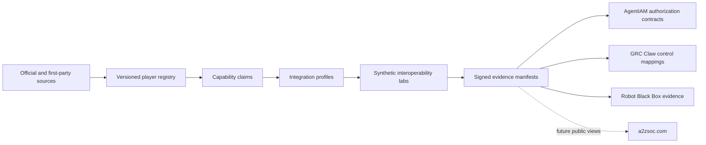

# Egypt Digital Trust Map

[](https://github.com/AAH20/egypt-digital-trust-map/actions/workflows/verify.yml)
[](LICENSE)

An open, bilingual-ready registry and interoperability lab for Egypt's IAM, PAM, PKI, cybersecurity, biometrics, video-surveillance governance, AI-agent identity, and critical-infrastructure ecosystem.

The project separates three things that are often confused:

1. **A player exists** — supported by a dated public source.
2. **A player claims a capability** — recorded as a claim, not an endorsement.
3. **An integration passed a test** — supported by a reproducible evidence bundle.

The current release is a seed registry and validation tool. It does not claim complete market coverage, certification, regulatory approval, or product endorsement. Coverage grows through source-backed pull requests and scheduled verification.

## Why this repository exists

Egypt has authoritative but distributed information: EG-CERT publishes accredited cybersecurity providers; ITIDA publishes licensed digital-signature providers; vendors and integrators publish their own services; and identity, physical security, and AI governance are normally evaluated in separate procurement processes. This repository provides one open data model for examining those relationships without collecting operational credentials, biometric templates, or surveillance footage.

## Architecture



## Repository structure

```text
registry/                 Source-backed market records
integrations/             Protocol and product-family profiles
schemas/                  JSON Schema contracts
src/egypt_trust_map/      Dependency-free validator and CLI
tests/                    Registry integrity tests
docs/                     Governance, contribution and roadmap detail
```

## Seed coverage

The first dataset records regulator and ecosystem entries from public sources, including NTRA/EG-CERT, ITIDA, the Egyptian Root CA, government CA, ITIDA-listed trust-service providers, CyShield, and ZeroTech. Records carry `source_status`, `last_verified`, and source URLs. Inclusion means only that the record has public evidence.

## Main integration profiles

- Identity federation: OpenID Connect, OAuth, SAML and LDAP
- Lifecycle governance: SCIM and joiner/mover/leaver evidence
- Strong authentication: FIDO2/WebAuthn and PKI
- Workload identity: SPIFFE/SPIRE
- Authorization: OpenID AuthZEN and AgentIAM contracts
- Privileged access and secrets: CyberArk, Delinea, BeyondTrust, OpenBao and Vault-compatible APIs
- Video systems: ONVIF event and device metadata, with synthetic fixtures only
- Evidence: OpenTelemetry, OSCAL-compatible mappings and Robot Black Box receipts
- Governance: GRC Claw evidence ingestion

Product names identify integration targets and do not imply affiliation.

## Run locally

```bash
python -m pip install -e .
egypt-trust-map verify
egypt-trust-map summary
python -m unittest discover -s tests -v
```

## Data-safety boundary

This repository accepts public organizational metadata, public integration documentation, synthetic identities, synthetic video events, and test evidence. It must not contain secrets, customer topology, government-only information, live camera feeds, facial templates, national-ID records, watchlists, or data obtained without authorization.

## Connected projects

- [AgentIAM Lab](https://github.com/AAH20/ai-agent-identity-authorization-security) supplies principal, delegation, authorization, receipt, and physical-action contracts.
- [GRC Claw](https://github.com/AAH20/GRC_Claw) consumes evidence and maps it to governance controls.
- [Robot Black Box](https://github.com/AAH20/robot-black-box) records accountable physical-AI actions.
- [Identity Fabric Benchmarks](https://github.com/AAH20/identity-fabric-benchmarks) supplies the international benchmark methodology.

## Future A2ZSOC integration

The data contracts are designed for future read-only pages such as `a2zsoc.com/egypt-trust-map`, `a2zsoc.com/egypt/integrations`, and `a2zsoc.com/egypt/conformance`. Those pages are roadmap items and are not implemented in this repository.

## License

Apache-2.0. Names and trademarks belong to their respective owners.
