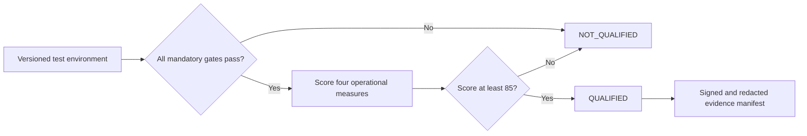

# Benchmark Methodology

The benchmark catalog measures whether a digital-trust architecture can retain local authority, constrain privileged and agentic action, protect biometric and surveillance workflows, and produce durable evidence. It evaluates deployable behavior rather than product claims or checklist presence.

## Evaluation model

The catalog contains 32 scenarios across root trust, sovereignty, IAM, tenant isolation, PAM, workload identity, AI agents, RAG context, biometrics, camera and surveillance edges, physical AI, evidence, supply chain, recovery, performance, resilience, interoperability and operability.

There are two result types:

- **28 mandatory gates** cover conditions that cannot be offset by speed or feature breadth. Failure of one gate returns `NOT_QUALIFIED`.
- **4 weighted measures** score performance, resilience, interoperability and operability. Their weights total 100, and the reference threshold is 85.

Qualification therefore requires every mandatory gate and a weighted score of at least 85.

The companion `benchmarks/kpis.json` establishes 16 inspectable reference targets. They cover authorization P95/P99, revocation convergence, privileged-grant lifetime, evidence completeness and tamper detection, unauthorized actions, camera egress, tenant isolation, external-isolation continuity, RTO, RPO, failover, protocol conformance, replacement restore and vendor-independent operations. Each record declares its comparison operator, target, unit and measurement procedure.



## Benchmark families

| Family | What it proves | Representative failure |
|---|---|---|
| Root trust and recovery | Local custody, quorum and recoverability | A single administrator can rotate a root |
| Sovereignty and continuity | Local decisions survive external isolation | Revocation depends on an unreachable foreign service |
| IAM and federation | Strong authentication and bounded assertions | A federated claim maps directly to permanent privilege |
| Tenant isolation | Identity, policy, evidence and keys remain separated | One tenant can query another tenant's objects |
| PAM | Just-in-time elevation, session control and revocation | Standing administrator credentials remain valid |
| Workload identity | Attested, short-lived machine identity | An unverified binary obtains a production credential |
| Agent governance | Delegation, tool and budget limits | An agent can broaden its own scope |
| RAG context | Provenance, policy filtering and injection resistance | Retrieved text overrides control policy |
| Biometrics | Consent, minimization, liveness and deletion | A raw template leaks into general logs |
| Surveillance edge | Signed device identity and bounded event export | A camera can send unrestricted media to an unapproved destination |
| Physical AI | Fresh authorization and safe stop | An expired grant still activates a machine |
| Evidence | Tamper evidence, independent retention and replay | Operators can rewrite receipts without detection |
| Supply chain | Signed admission, inventory and rollback | An unsigned component reaches the control plane |
| Recovery | Restore and supplier-exit proof | Export exists but cannot recreate service |
| Operational measures | Latency, disruption recovery, portability and workload | Passing controls create unusable service levels |

## Reproducible test environment

Every named-product result must record exact component versions, deployment mode, enabled features, policy bundle hash, synthetic dataset version, test harness version, time source, hardware class and network assumptions. Results from hosted, self-hosted and disconnected deployments are separate results.

Tests use synthetic principals, faces, documents, camera events, robot actions and credentials. A test must never import production identities, watchlists, video, biometric templates or privileged secrets. Integration targets without a completed evidence bundle remain `not-tested` regardless of vendor documentation.

## Evidence bundle

Each scenario identifies required evidence types. A publishable bundle should contain:

1. a manifest with scenario, environment and artifact identifiers;
2. signed test-run metadata and synchronized timestamps;
3. redacted request, decision and outcome receipts;
4. hashes for configuration, policy and relevant binaries;
5. expected and observed results;
6. reviewer identity represented by an organizational role or pseudonymous signing identity;
7. an expiry or revalidation date.

Raw sensitive artifacts stay in the deployment's protected evidence store. The public bundle includes only minimized extracts and hashes that permit verification without revealing an attack map.

## Scoring operational measures

Metric scores range from 0 to 100. A test profile must publish the interpolation rule before a run. For example, a revocation-latency measure can award 100 at or below its target, decline linearly through a declared tolerance interval, and award zero above the maximum. Missing measurements score zero. Failed mandatory gates remain disqualifying even when the metric score is 100.

The four weighted measures are:

- performance and authorization latency — 40%;
- resilience and recovery — 30%;
- standards interoperability and portability — 20%;
- operational effort and repeatability — 10%.

## Anti-gaming and evolution

Test fixtures are versioned. Public scenarios remain visible so implementers can reproduce them, while independent assessors may add private variants that preserve the published objective. Retests must disclose configuration changes. Results expire when material software, trust roots, deployment mode or control ownership changes.

New scenarios enter as experimental, collect cross-implementation evidence, then graduate into scored measures or mandatory gates through a documented version change. Removing or weakening a gate requires a public rationale and a major profile revision.

Run the reference evaluation with:

```bash
egypt-trust-map benchmark
```
