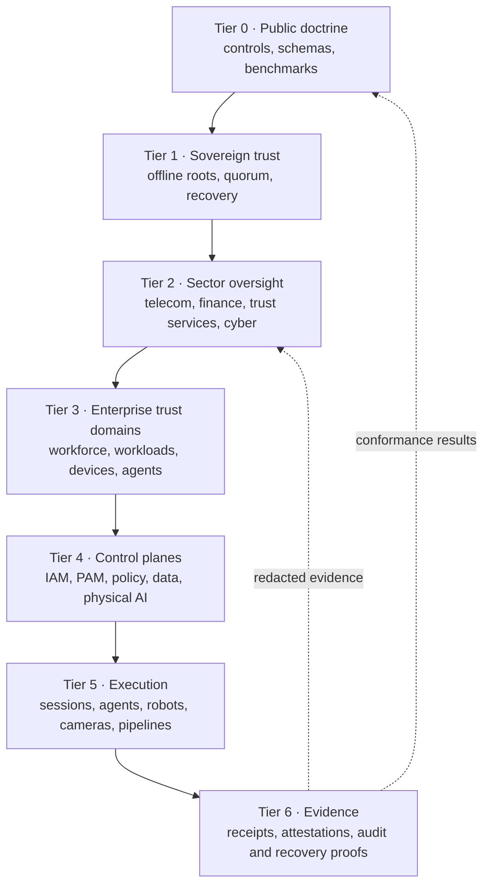

# Hierarchical Trust System

This document describes the public reference hierarchy in `hierarchy/reference-hierarchy.json`. It is an assurance model, not an operational deployment diagram. It names control planes and abstract roles while deliberately excluding people, credentials, cryptographic material, addresses, endpoints, customer deployments and classified relationships.

## Design objective

The hierarchy gives every human, workload, AI agent, device and physical machine a bounded identity, a documented authority source and an independently verifiable evidence trail. Authority narrows as it moves downward. Evidence moves upward only through redacted receipts and aggregate health signals. No lower tier can mint authority for a higher tier, and no single vendor or administrator is modeled as an unrecoverable trust anchor.



## Tiers

| Tier | Purpose | May issue | Must never expose publicly |
|---|---|---|---|
| 0 — public doctrine | Defines schemas, controls, test methods and publication rules | Versioned public baselines | Operational exceptions or deployment details |
| 1 — sovereign trust | Anchors signing, federation, recovery and emergency governance | Bounded trust anchors and signed policy releases | Private keys, recovery shares, custodian identities or HSM topology |
| 2 — sector oversight | Maps regulatory obligations and sector-specific assurance | Control profiles and verification requirements | Investigative data, non-public supervisory findings or sensitive dependencies |
| 3 — enterprise trust domain | Separates organizations, tenants and environments | Local issuers, namespaces and delegated policy | Customer topology, personnel directories or privileged group membership |
| 4 — control plane | Makes identity, privilege, policy, data and machine-control decisions | Short-lived grants and signed decisions | Credentials, policy exceptions, biometric material or vendor support paths |
| 5 — execution | Performs bounded digital or physical tasks | Telemetry and action requests | Live sessions, camera feeds, location data or target lists |
| 6 — action and evidence | Captures tamper-evident receipts and recovery proof | Redacted attestations and aggregate results | Raw sensitive events, faces, national identifiers or exploitable configuration |

## Compartments

The model defines four information compartments:

1. **Public** contains schemas, source-backed market metadata, synthetic fixtures, benchmark definitions and redacted results.
2. **Restricted operations** contains service health, inventories and operational runbooks available only to authorized operators.
3. **Confidential security** contains detailed policy, incident evidence, privileged relationships and architecture required for defense.
4. **Secret material** contains private keys, recovery shares, credentials and equivalent trust-anchor material. It must remain inside approved cryptographic or recovery boundaries.

Classification is independent of organizational seniority. A board-level summary may be public or restricted, while a machine-held signing share remains secret. Access requires purpose, role, environment, time and approval context; title alone is insufficient.

## Authority and information flow

The reference model enforces these directions:

- **Policy flows downward:** higher tiers delegate constrained policy and verifiable trust, never unrestricted control.
- **Evidence flows upward:** lower tiers emit signed, minimized receipts. Raw sensitive payloads stay within their lawful processing boundary.
- **Recovery crosses peers:** root and emergency actions use quorum, separation of duties and independent evidence custody.
- **Federation crosses domains:** external identities arrive as assertions and are translated to local, short-lived authority. Federation never silently becomes root ownership.
- **Physical action requires a fresh decision:** a robot, vehicle, camera workflow or biometric gate acts only on an explicit scoped grant and records the result.

## Control-plane separation

The IAM plane establishes principals and authentication strength. PAM brokers privileged sessions and ephemeral secrets. The workload plane attests software and service identities. The agent plane limits delegation, tools, budgets and action scope. The data plane applies residency, purpose and retention rules. The biometric and surveillance plane converts sensor events into minimized assertions. The physical-AI plane binds digital approval to actuator constraints. The evidence plane records what every plane decided and why.

Each plane must be independently replaceable through documented standards, exports and recovery procedures. A combined product may implement several planes, but qualification still tests each responsibility separately.

## Failure containment

Compromise of one execution node must not grant control of its tenant, trust domain or root. Compromise of one tenant must not cross into another. Loss of an external control plane must not stop local revocation or emergency operation. Loss of an evidence sink must fail visibly and trigger bounded safe behavior rather than silently discarding audit records.

Public conformance reports disclose the profile, software versions, synthetic test identifiers, pass/fail results and evidence hashes. They exclude live identities, endpoints, customer names, topology and raw security telemetry.

## Machine verification

Run:

```bash
egypt-trust-map verify-hierarchy
```

The validator requires contiguous tiers, unique node identifiers, one tier-zero root, strictly higher-tier parents and public outputs for every node. It also rejects a defined set of sensitive field names anywhere in the public hierarchy document.
