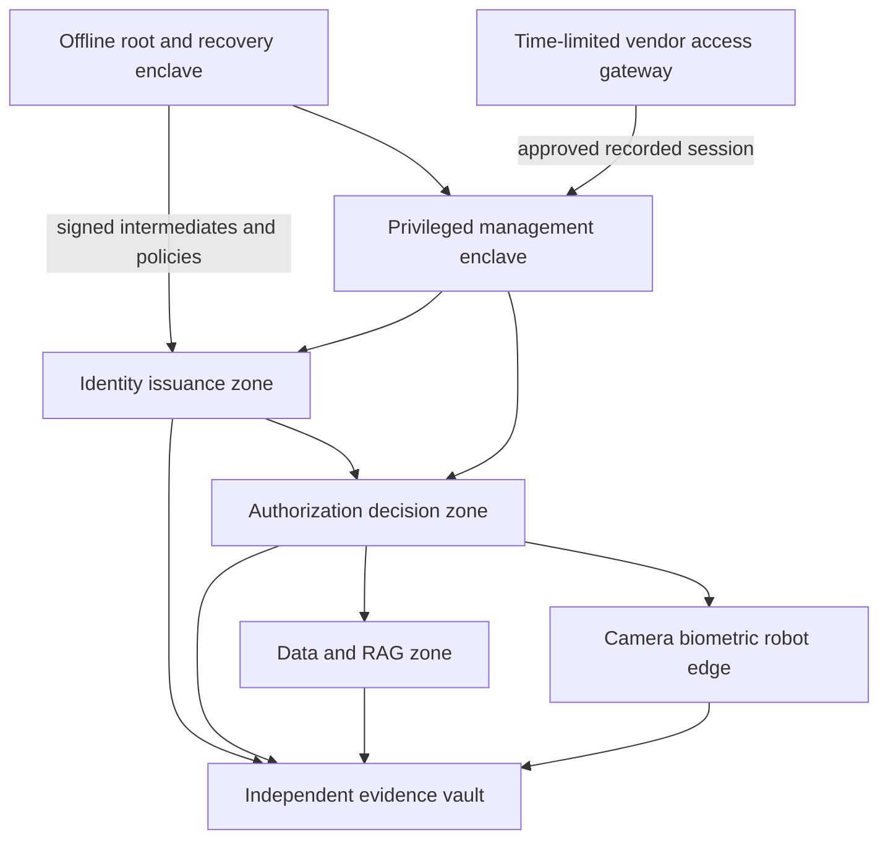

# Egypt sovereign identity and privileged-access reference architecture

## Objective

The architecture keeps the minimum viable trust chain under Egyptian operational control while preserving standards-based interoperability with local and international products. Sovereignty is measured by who can issue, approve, revoke, recover, observe, update, and replace the system during normal operation and external isolation.

It does not require every component to be written in Egypt. It requires Egyptian control over the security outcome and a credible path to inspect, operate, recover, and replace every dependency.

## Trust planes

### 1. Constitutional trust plane

This plane contains offline root CAs, policy-signing roots, evidence-signing roots, recovery material, and the authoritative definition of trust domains. Root operations require an M-of-N ceremony with participants from separate reporting lines. No single executive, vendor, administrator, or automation account holds all recovery material.

Required evidence:

- Ceremony plan, participant roles, device serials and signed transcript.
- HSM initialization and backup evidence.
- Key-use policy and cryptoperiod.
- Recovery test with measured recovery time and independent observer.
- Destruction or retirement record for superseded material.

### 2. Identity issuance plane

Human, workload, service, agent, model, tool, device, robot, vehicle and data-product identities use separate namespaces and issuance policies. Federation converts external assertions into local, audience-bound, time-limited sessions; it does not import external super-admin authority.

Core controls:

- Authoritative workforce source and joiner/mover/leaver workflow.
- Phishing-resistant authentication for privileged identities.
- SPIFFE/SPIRE or equivalent attested workload identity.
- Unique agent identity linked to an accountable principal and approved purpose.
- Device and robot attestation linked to firmware and model digests.
- Separate production, recovery, security, build and evidence trust domains.

### 3. Privileged-access plane

The core uses short-lived credentials and just-in-time grants. Standing privilege is treated as an exception with an owner, business purpose, expiry and compensating monitoring. Secrets storage alone is insufficient: session establishment, command policy, approval, revocation and evidence must be tested end to end.

No universal hidden master account is permitted. Emergency authority is implemented as a sealed, quorum-approved capability that is time-limited, purpose-bound, independently recorded, and reviewed after use.

### 4. Authorization and delegation plane

Local policy decision points evaluate principal, tenant, purpose, delegation chain, resource, action, environment, risk, approvals, device posture and evidence obligations. A child agent cannot obtain authority absent from the parent grant. Policy or identity-plane unavailability fails closed for material actions.

AgentIAM provides the portable request, delegation, decision, receipt and physical-action contracts. OPA/Rego or another replaceable engine may evaluate policy behind those contracts.

### 5. Data, RAG and biometric plane

Retrieval authorization applies before vector or document content reaches an AI model. Index entries preserve source ACL and classification references. Cache, embedding and generated-answer paths carry the authorization context.

Biometric systems produce a signed, narrowly scoped assertion such as `liveness-verified for door-17 at time-T`. Raw templates remain in a separately governed store and never enter AgentIAM receipts, general logs, prompts, or public evidence.

### 6. Physical-security and physical-AI edge

Cameras, access controllers, robots, vehicles and autopilots reside in segmented zones with default-deny egress. Vendor cloud features are disabled unless explicitly approved. A local gateway normalizes ONVIF, ROS 2, MAVLink or proprietary events into signed evidence without exposing direct device administration to the enterprise identity plane.

Material robot or vehicle actions require device attestation, a known safety state, exact model or firmware digest, a short-lived action lease, and an independent safety controller able to stop execution.

### 7. Evidence and recovery plane

Every material identity, policy, privilege and physical action produces an append-only event with stable identifiers and cryptographic digests. Evidence is copied into a separately administered store whose signing and retention controls do not depend on the system being investigated.

Backups are not sufficient. The program must demonstrate clean-room restore, root recovery, policy reconstruction, revocation continuity, audit verification, and migration to a replacement implementation.

## Deployment zones

The vendor gateway is disabled by default. Activation requires a ticket, named individual, approved purpose, exact target, short expiry, session recording, egress allow-list, malware scanning and post-session credential rotation.

## Preferred inspectable components and their limits

| Function | Candidate | Sovereignty value | Remaining work |
|---|---|---|---|
| Workforce and application identity | Keycloak | Self-hosted OIDC/SAML and replaceable protocols | Hardening, HA, lifecycle source, admin separation |
| Linux identity | FreeIPA | Local directory, Kerberos and certificate integration | Cross-domain design and recovery testing |
| Legacy directory compatibility | Samba AD/OpenLDAP | Reduces proprietary lock-in at protocol boundary | Feature parity and migration testing |
| Secrets and dynamic credentials | OpenBao | Inspectable, community-governed and self-hosted | HSM design, HA, plugins, ceremonies and operations |
| Workload identity | SPIRE | Attested short-lived identities | Node attestors, federation and trust-domain operations |
| Policy | OPA/Rego | Replaceable policy engine | Policy governance, testing and decision logs |
| Agent authority | AgentIAM | Purpose-bound delegation and receipts | Production signing, adapters and independent review |
| Governance evidence | GRC Claw | Control mapping and evidence automation | Data contracts and assurance workflows |
| Physical-action evidence | Robot Black Box | Action and incident reconstruction | Hardware anchoring and safety integration |

Inspectable and self-hostable components can improve verification and exit options; they do not remove supply-chain, insider, configuration, maintenance or governance risk. Qualification depends on benchmark evidence and measured KPIs rather than a licensing label.

## Foreign-product compatibility boundary

A foreign IAM/PAM product may connect only through documented standards or a constrained adapter. It receives scoped identities, never the offline root. It cannot delete the independent evidence copy, override local policy, silently create accounts, or require continuous foreign connectivity for sovereign functions.

Acceptance requires:

1. Full data-flow and telemetry inventory.
2. Named support paths and proof they are disabled by default.
3. Customer-controlled encryption and signing keys where technically possible.
4. Signed artifacts, SBOM, staged updates and rollback.
5. Export and restore of identities, policies, secrets metadata and evidence.
6. Isolation test proving critical functions continue without vendor connectivity.
7. Replacement exercise using a second implementation.

## Governance structure

- **Trust authority:** owns root policy but cannot operate production alone.
- **Platform operator:** runs identity and PAM but cannot alter audit evidence.
- **Security assurance:** tests controls and approves high-risk changes.
- **Data and privacy authority:** governs identity, biometric and surveillance data use.
- **Business owner:** approves purpose and risk acceptance.
- **Independent audit:** verifies ceremonies, evidence and recovery.

Separation of duties is enforced technically through distinct trust domains, credentials, HSM roles, repositories and evidence stores.
